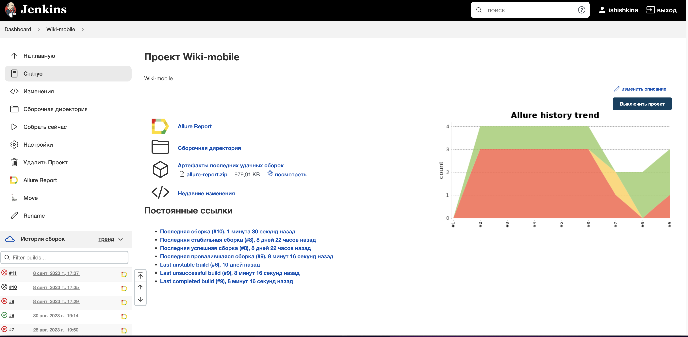
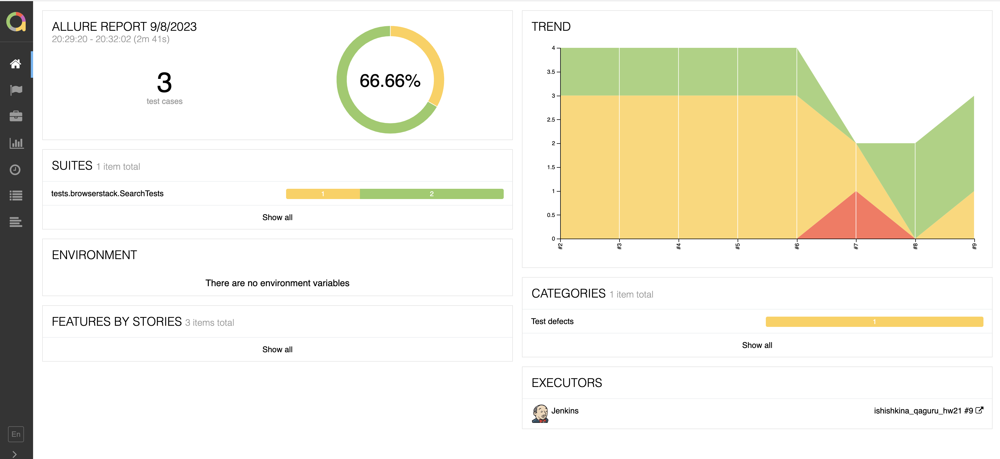
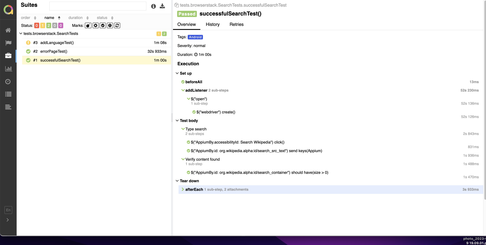
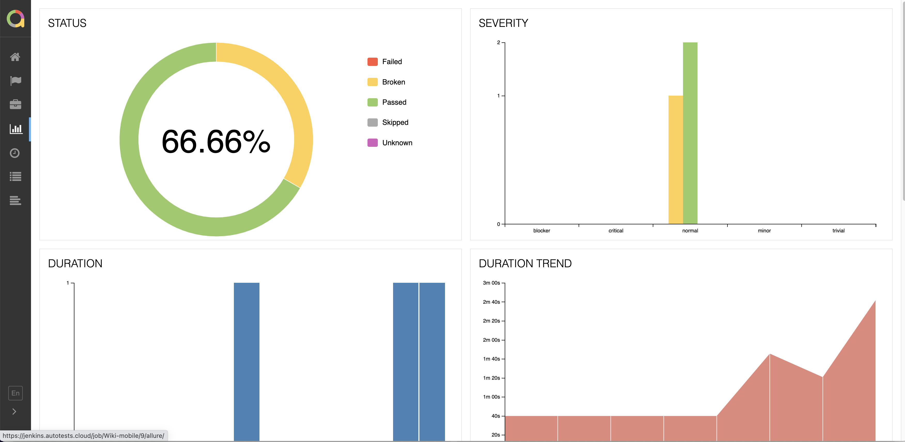
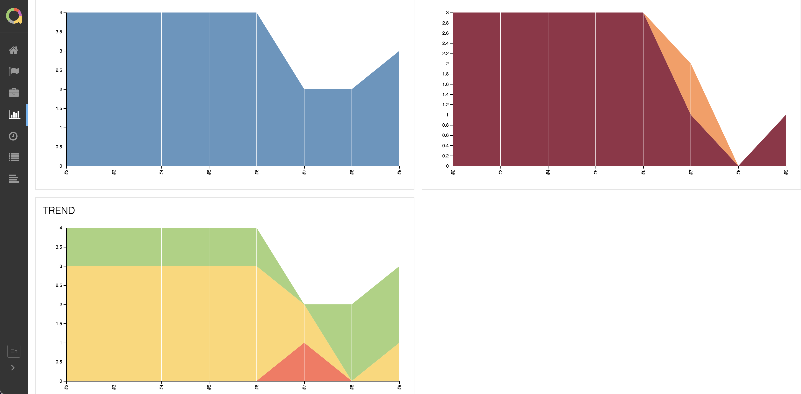

# Проект по базовой автоматизации тестирования мобильной версии [Wikipedia](wikipedia.org)

> Википе́дия (англ. Wikipedia) — общедоступная многоязычная универсальная интернет-энциклопедия со свободным контентом, реализованная на принципах вики.
## **Содержание:**
____

* <a href="#tools">Технологии и инструменты</a>

* <a href="#jenkins">Сборка в Jenkins</a>

* <a href="#console">Запуск из терминала</a>

* <a href="#allure">Allure отчет</a>


____
<a id="tools"></a>
## <a name="Технологии и инструменты">**Технологии и инструменты:**</a>

<p align="center">  
<a href="https://www.jetbrains.com/idea/"></a>  
<a href="https://www.java.com/"></a>  
<a href="https://github.com/"></a>
<a href="https://gradle.org/"></a>  
<a href="https://selenide.org/"></a>  
<a href="https://aerokube.com/selenoid/"></a>  
<a href="ht[images](images)tps://github.com/allure-framework/allure2"></a> 
<a href="https://qameta.io/"></a>   
<a href="https://www.jenkins.io/"></a>  
<a href="https://www.atlassian.com/ru/software/jira/"></a>  
</p>
<p>

1. [ ] Автотесты написаны на Java с использованием фреймворка Selenide.
3. [ ] Gradle - используется как инструмент автоматизации сборки.
5. [ ] JUnit5 - используется для выполнения тестов.
6. [ ] Jenkins - используется CI/CD для запуска тестов удаленно.
8. [ ] Allure Report - используется для визуализации результатов тестирования.

Тесты проверяют:
1. [ ] успешный поиск по порталу,
2. [ ] безуспешный поиск по порталу,
3. [ ] проверка функционала смены языка.
</p>

<a id="jenkins"></a>

## </a><a name="Сборка"></a>Сборка в [Jenkins](https://jenkins.autotests.cloud/job/Wiki-mobile/)</a>
____
<p align="center">  
<a href="https://jenkins.autotests.cloud/job/Wiki-mobile////"></a>  
</p>


<a id="console"></a>
## Команды для запуска из терминала
___
***Локальный запуск:***
```bash  
gradle clean test
```

***Удалённый запуск через Jenkins:***
```bash  
clean test
```
___
<a id="allure"></a>
## </a> <a name="Allure"></a>Allure [отчет](https://jenkins.autotests.cloud/job/Wiki-mobile/9/allure/#)</a>
___

### *Основная страница отчёта*

<p align="center">  
  
</p>  

### *Тест-кейсы*

<p align="center">  
  
</p>

### *Графики*

  <p align="center">  


  
</p>

___
